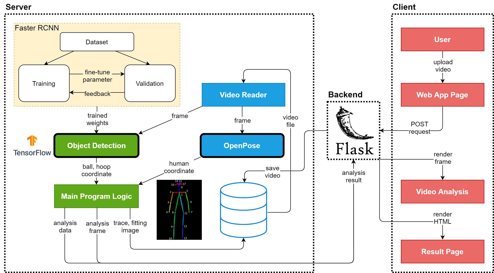
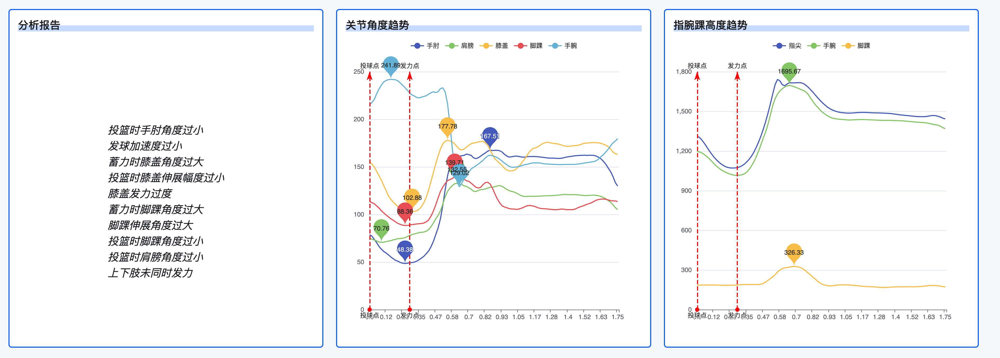

<p align=center>
    
</p>


> 🏀 使用YOLO V5和MediaPipe来分析投篮姿势

这是一个基于目标检测构建的人工智能应用程序。通过深入分析从对象检测中收集的数据，可以对篮球投篮进行分析。用户可以通过简单地上传文件到Web应用程序，提交POST请求来获取结果。请查看下面的特点。还有更多特性正在开发中！欢迎star。

所有用于投篮姿势分析的数据都是通过使用`MediaPipe`来分析投篮姿势来计算的，同时篮球检测是使用最新的`YOLO V8`模型。

## 入门指南

以下说明将帮助在本地计算机上获取该项目并运行它。

### 获取项目

通过运行git clone命令获取项目。

``` git
git clone https://github.com/sisipyhus/AI-BasketBall-Analysis.git
```

### 前置

在运行项目之前，我们需要安装requirements.txt文件中的所有依赖项。

``` pip
pip install -r requirements.txt
```
项目的运行对GPU没有要求，也可以使用CPU。

此外，还需要安装`ffmpeg`, 可以前往ffmpeg的官网查看相关的安装事宜。使用ffmpeg主要是为了将经过处理的视频从`avi`转换成`mp4`。

### 运行

运行该项目, 通过使用`python app.py` 即可

``` python
python app.py
```

<p align=center>
    
</p>

#### Alternatives


## Project Structure

<p align=center>
    
</p>

## 功能

本项目的主要功能是分析投篮姿势（站立投篮）的姿势是否标准。

### 姿势分析
本项目通过预设的诸多实验数据和分析，通过分析谷歌节点之间的角度，从而来研判动作是否规范。



## 检测模型
YoLo v8用于篮球检测

Mideapipe用于骨骼点位检测


## 计划
- [ ] 上传视频的分割，只提交视频中投篮的部分，需要使用DAT（时序动作检测）
- [ ] Python程序对于数据更为准确，需要大量的数据进行训练
- [ ] 移动端与桌面端支持
